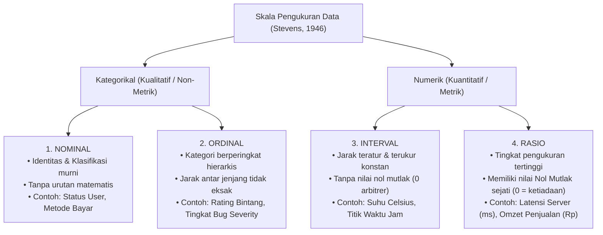
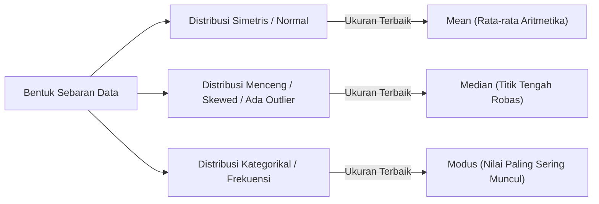
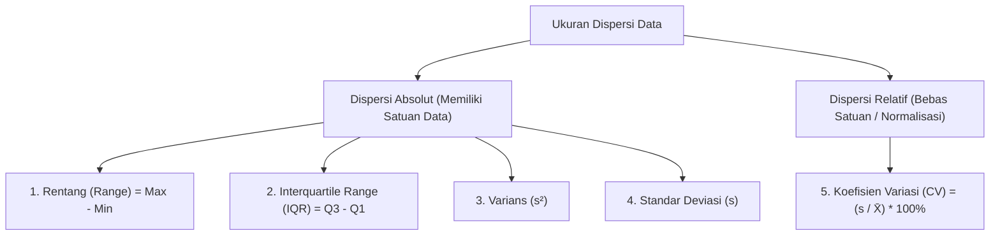
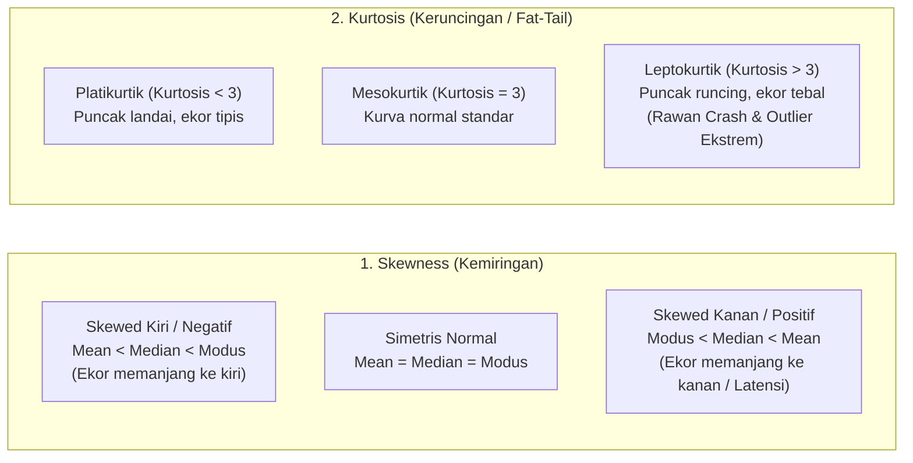
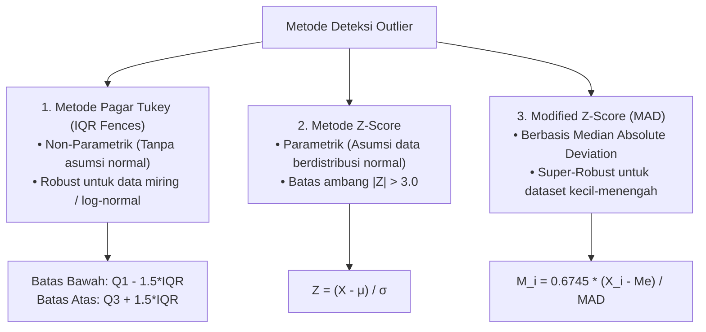

# BAB 01: UKURAN DASAR STATISTIKA, TAKSONOMI DATA & DETEKSI PENCILAN
**Mata Kuliah:** Statistika Komputasi  
**Penyusun:** Dr. Ridwan Ilyas, S.Kom., M.T.  
**Program Studi:** Teknik Informatika, Fakultas Sains dan Informatika, Universitas Jenderal Achmad Yani (UNJANI)  
**Tahun Akademik:** 2026  
**Lisensi:** Open Source (MIT)

---

## 🎯 Capaian Pembelajaran Bab (Sub-CPMK)
Setelah menyelesaikan bab ini, mahasiswa diharapkan mampu:
1. Mengidentifikasi 4 skala pengukuran data (*Nominal, Ordinal, Interval, Rasio*) menurut Stanley Smith Stevens serta menentukan operasi matematika dan struktur data yang sah.
2. Menghitung dan memilih ukuran pemusatan data (*Mean, Median, Modus, Trimmed Mean, Geometric Mean, Harmonic Mean*) yang tepat berdasarkan bentuk distribusi dan tipe skala data.
3. Menganalisis ukuran dispersi data (*Range, IQR, Varians, Standar Deviasi, Koefisien Variasi*) serta memahami signifikansi koreksi Bessel ($n-1$) pada komputasi sampel.
4. Menilai karakteristik bentuk distribusi data melalui koefisien *Skewness* dan *Kurtosis*.
5. Merancang algoritma deteksi nilai pencilan (*outlier*) menggunakan metode Pagar Tukey (*Tukey Fences*) dan *Z-Score* untuk penjaminan mutu data (*Data Quality Assurance*).

---

## 1. 📊 Taksonomi & Skala Pengukuran Data

Dalam ilmu komputasi dan rekayasa perangkat lunak, data bukan sekadar deretan angka atau karakter biner di dalam memori, melainkan representasi formal dari fenomena dunia nyata. Pada tahun 1946, psikolog dan ilmuwan komputasi **Stanley Smith Stevens** memperkenalkan taksonomi 4 skala pengukuran data yang hingga kini menjadi fondasi utama dalam *Data Preprocessing*, *Feature Engineering*, dan penentuan algoritma Machine Learning:



### 1.1 Karakteristik 4 Skala Pengukuran

| Skala Pengukuran | Relasi & Karakteristik Utama | Operasi Matematika yang Sah | Ukuran Pemusatan yang Sah | Contoh dalam Sistem Komputasi |
| :--- | :--- | :---: | :---: | :--- |
| **1. Nominal** | Kesamaan dan perbedaan ($=, \neq$). Tanpa bobot angka. | Frekuensi, Tabulasi Silang (*Crosstab*) | **Modus** | `role_id` (`Admin`, `User`), `payment_gateway` (`E-Wallet`, `Credit Card`), `os_name` |
| **2. Ordinal** | Urutan peringkat hierarkis ($=, \neq, <, >$). Jarak antar jenjang tidak terukur konstan. | Ranking, Persentil, Median | **Median**, Modus | Tingkat Keparahan Bug (`Minor < Major < Critical`), Skala Likert 1–5, Tier Member |
| **3. Interval** | Jarak teratur ($=, \neq, <, >, +, -$). **Tidak memiliki nol mutlak** ($0^\circ\text{C}$ bukan ketiadaan temperatur). | Penjumlahan, Pengurangan, Rata-rata Aritmetika | **Mean**, Median, Modus | Suhu Prosesor CPU ($^\circ\text{C}$), Tahun Kalender, Skor IQ, Format Timestamp |
| **4. Rasio** | Skala metrik tertinggi ($=, \neq, <, >, +, -, \times, \div$). **Memiliki nol mutlak sejati** ($0\text{ ms} = $ ketiadaan latensi). | Semua operasi aritmetika & kelipatan rasio | **Semua Mean** (Aritmetika, Geometrik, Harmonik) | Latensi API (ms), Penggunaan Memori RAM (MB), Omzet Transaksi (Rp), *Lines of Code* |

> ⚠️ **Peringatan Rekayasa Data (*Anti-Pattern Trap*):**  
> Menghitung nilai rata-rata (*Mean*) pada data berskala **Nominal** (misal: kode pos atau nomor ID pengguna) atau data berskala **Ordinal** (misal: tingkat kepuasan `Low=1, Med=2, High=3` yang diperlakukan sebagai jarak numerik eksak) adalah kesalahan fatal yang menghasilkan kesimpulan bias pada algoritma komputasi.

---

## 2. 🎯 Ukuran Pemusatan Data (*Measures of Central Tendency*)

Ukuran pemusatan data bertujuan untuk merangkum seluruh sebaran kumpulan data menjadi satu nilai representatif yang mewakili "titik tengah" dari distribusi data.



### 2.1 Rata-rata Aritmetika (*Arithmetic Mean*)
Nilai rata-rata hitung yang diperoleh dari pembagian total jumlah seluruh nilai pengamatan dengan banyaknya data.

* **Formula Populasi ($\mu$):**
  $$\mu = \frac{1}{N} \sum_{i=1}^{N} X_i$$

* **Formula Sampel ($\bar{X}$):**
  $$\bar{X} = \frac{1}{n} \sum_{i=1}^{n} X_i$$

* **Sifat Kritis:**  
  Mean sangat sensitif terhadap nilai pencilan (*outlier*). Adanya satu nilai ekstrem (misal: kegagalan koneksi jaringan dengan *timeout* 30.000 ms) akan menarik nilai Mean secara drastis, sehingga tidak lagi mewakili performa sistem sebenarnya.

---

### 2.2 Nilai Tengah (*Median*)
Nilai yang membelah data terurut menjadi dua bagian sama besar (50% data berada di bawah median, 50% berada di atas median).

* **Formula untuk Data Ganjil ($n$ ganjil):**
  $$Me = X_{\left(\frac{n+1}{2}\right)}$$

* **Formula untuk Data Genap ($n$ genap):**
  $$Me = \frac{X_{\left(\frac{n}{2}\right)} + X_{\left(\frac{n}{2} + 1\right)}}{2}$$

* **Sifat Kritis (*Robustness*):**  
  Median memiliki *breakdown point* sebesar 50%, artinya nilai median tidak akan terpengaruh meskipun hingga 50% data terkontaminasi oleh pencilan ekstrem.

---

### 2.3 Nilai Terbanyak (*Modus*)
Nilai data yang memiliki frekuensi kemunculan tertinggi di dalam kumpulan data.
* **Unimodal:** Memiliki 1 nilai modus dominan.
* **Bimodal:** Memiliki 2 nilai modus dengan frekuensi sama tinggi (sering mengindikasikan adanya dua sub-populasi, misal: pengguna *Desktop* vs *Mobile*).
* **Multimodal:** Memiliki lebih dari 2 modus.
* **Modus adalah satu-satunya ukuran pemusatan yang sah untuk data berskala Nominal.**

---

### 2.4 Variasi Rata-rata Khusus untuk Komputasi

#### A. Rata-rata Terpangkas (*Trimmed Mean*)
Menghitung rata-rata setelah membuang proporsi persentase tertentu ($\alpha$, misal 5% atau 10%) dari nilai terkecil dan terbesar untuk meredam gangguan pencilan:
$$\bar{X}_{\text{trimmed}} = \frac{1}{n - 2k} \sum_{i=k+1}^{n-k} X_{(i)}$$
di mana $k = \lfloor n \cdot \alpha \rfloor$.

#### B. Rata-rata Geometrik (*Geometric Mean*)
Digunakan untuk data yang berupa laju pertumbuhan (*growth rates*), rasio kompresi gambar, atau penggandaan finansial:
$$G = \sqrt[n]{\prod_{i=1}^{n} X_i} = \exp\left( \frac{1}{n} \sum_{i=1}^{n} \ln(X_i) \right)$$

#### C. Rata-rata Harmonik (*Harmonic Mean*)
Digunakan untuk data yang berupa rasio kecepatan atau laju waktu terhadap kapasitas (misal: *Throughput*, kecepatan transfer jaringan KBps, dan metrik evaluasi Machine Learning **F1-Score**):
$$H = \frac{n}{\sum_{i=1}^{n} \frac{1}{X_i}}$$

$$\text{Hubungan Teoretis Matematika:} \quad H \le G \le \bar{X} \quad (\text{sama jika dan hanya jika semua } X_i \text{ identik})$$

---

## 3. 📏 Ukuran Penyebaran / Dispersi Data (*Measures of Dispersion*)

Dua kumpulan data sistem perangkat lunak dapat memiliki nilai rata-rata yang sama persis ($\bar{X} = 100\text{ ms}$), namun kumpulan data pertama sangat stabil ($98\text{ ms} - 102\text{ ms}$) sedangkan kumpulan data kedua sangat fluktuatif ($10\text{ ms} - 450\text{ ms}$). Ukuran penyebaran mendeskripsikan seberapa jauh data bervariasi di sekitar nilai pusatnya.



### 3.1 Rentang (*Range*)
Selisih antara nilai pengamatan maksimum dengan nilai minimum:
$$\text{Range} = X_{\max} - X_{\min}$$
*Sangat peka terhadap outlier dan hanya memanfaatkan dua titik data ekstrem.*

---

### 3.2 Rentang Antarkuartil (*Interquartile Range - IQR*)
Selisih antara Kuartil Atas ($Q_3$ / Persentil ke-75) dengan Kuartil Bawah ($Q_1$ / Persentil ke-25):
$$\text{IQR} = Q_3 - Q_1$$
*IQR mencakup rentang sebaran 50% data bagian tengah dan bersifat sangat robas terhadap pencilan.*

---

### 3.3 Varians & Standar Deviasi

#### A. Varians Populasi ($\sigma^2$) vs Sampel ($s^2$)
Varians mengukur rata-rata kuadrat deviasi tiap titik data dari nilai rata-ratanya:

* **Varians Populasi:**
  $$\sigma^2 = \frac{1}{N} \sum_{i=1}^{N} (X_i - \mu)^2$$

* **Varians Sampel (Koreksi Bessel):**
  $$s^2 = \frac{1}{n - 1} \sum_{i=1}^{n} (X_i - \bar{X})^2$$

> 💡 **Mengapa Dibagi $(n-1)$? (Koreksi Bessel):**  
> Pembagi $n-1$ (derajat kebebasan / *degrees of freedom*) digunakan untuk mengoreksi bias estimasi (*unbiased estimator*). Karena sampel cenderung terkonsentrasi lebih dekat ke nilai rata-rata sampelnya sendiri ($\bar{X}$) dibanding ke rata-rata populasi sejati ($\mu$), membagi dengan $n$ akan menghasilkan estimasi varians yang terlalu kecil (*underestimate*).

#### B. Standar Deviasi ($\sigma, s$)
Akar kuadrat dari varians, mengembalikan satuan penyebaran kembali ke satuan asli data:
$$s = \sqrt{s^2} = \sqrt{\frac{1}{n-1} \sum_{i=1}^{n} (X_i - \bar{X})^2}$$

#### C. Aturan Empiris Distribusi Normal (*The 68-95-99.7 Rule*)
Pada data yang terdistribusi normal lonceng simetris:
* **$\approx 68.27\%$** data terletak di dalam rentang $\mu \pm 1\sigma$.
* **$\approx 95.45\%$** data terletak di dalam rentang $\mu \pm 2\sigma$.
* **$\approx 99.73\%$** data terletak di dalam rentang $\mu \pm 3\sigma$.

---

### 3.4 Koefisien Variasi (*Coefficient of Variation - CV*)
Rasio standar deviasi terhadap rata-rata, dinyatakan dalam persentase, untuk membandingkan tingkat variabilitas antar dua variabel yang memiliki skala atau satuan unit yang berbeda (misal: membandingkan stabilitas latensi dalam milidetik vs penggunaan memori dalam Megabyte):
$$\text{CV} = \left( \frac{s}{\bar{X}} \right) \times 100\%$$

* $\text{CV} < 15\%$ : Variabilitas Rendah (Sangat Stabil / Homogen)
* $15\% \le \text{CV} \le 30\%$ : Variabilitas Sedang
* $\text{CV} > 30\%$ : Variabilitas Tinggi (Heterogen / Fluktuatif)

---

## 4. 📐 Ukuran Bentuk Distribusi (*Measures of Shape*)

Ukuran bentuk memberikan profil visual matematis mengenai kesimetrisan dan ketebalan ekor (*tail*) distribusi data komputasi.



### 4.1 Kemiringan Distribusi (*Skewness*)
Mengukur derajat ketidaksimetrisan distribusi data di sekitar nilai rata-ratanya (Momen ke-3):
$$\text{Skewness} = \frac{\frac{1}{n} \sum_{i=1}^{n} (X_i - \bar{X})^3}{\left[ \frac{1}{n} \sum_{i=1}^{n} (X_i - \bar{X})^2 \right]^{3/2}}$$

* **$\text{Skewness} = 0$** : Distribusi Simetris Sempurna ($\text{Mean} \approx \text{Median} \approx \text{Modus}$).
* **$\text{Skewness} > 0$ (Menceng Kanan / Positif)** : Ekor distribusi memanjang ke arah kanan ($\text{Modus} < \text{Median} < \text{Mean}$). *Paling sering ditemukan pada data latensi server, pendapatan transaksi e-commerce, dan durasi perbaikan bug.*
* **$\text{Skewness} < 0$ (Menceng Kiri / Negatif)** : Ekor memanjang ke arah kiri ($\text{Mean} < \text{Median} < \text{Modus}$). *Ditemukan pada data nilai ujian mahasiswa atau skor kepuasan software siap rilis.*

---

### 4.2 Keruncingan Distribusi (*Kurtosis*)
Mengukur ketinggian puncak dan ketebalan ekor distribusi data (Momen ke-4):
$$\text{Kurtosis} = \frac{\frac{1}{n} \sum_{i=1}^{n} (X_i - \bar{X})^4}{\left[ \frac{1}{n} \sum_{i=1}^{n} (X_i - \bar{X})^2 \right]^2}$$

* **Mesokurtik ($\text{Kurtosis} = 3$ atau $\text{Excess Kurtosis} = 0$):** Distribusi normal standar.
* **Leptokurtik ($\text{Kurtosis} > 3$ atau $\text{Excess} > 0$):** Puncak sangat tajam dan ekor tebal (*fat-tailed*). Mengindikasikan probabilitas kemunculan nilai pencilan ekstrem (*black swan events* / lonjakan beban sistem tiba-tiba) jauh lebih tinggi dibanding distribusi normal.
* **Platikurtik ($\text{Kurtosis} < 3$ atau $\text{Excess} < 0$):** Puncak relatif mendatar dengan ekor yang tipis.

---

## 5. 🔍 Deteksi Nilai Ekstrim / Pencilan (*Outlier Detection*)

Pencilan (*outlier*) adalah titik data yang berjarak sangat jauh dari sebagian besar pola sebaran data lainnya. Pencilan dapat bersumber dari:
1. **Galat Input Data (*Measurement/Input Error*):** Nilai umur user tercatat 999 tahun.
2. **Anomali Sistem (*True Anomaly*):** Serangan siber *DDoS* atau kegagalan *database deadlock*.
3. **Variabilitas Alami:** Transaksi pembelian bernilai sangat besar (*Whale Customer*).



### 5.1 Metode Pagar Tukey (*Tukey's Fences*)
Metode non-parametrik yang memanfaatkan kuartil dan IQR (tidak mensyaratkan asumsi distribusi normal):
* **Pagar Bawah (*Lower Fence*):**
  $$\text{LF} = Q_1 - 1.5 \times \text{IQR}$$
* **Pagar Atas (*Upper Fence*):**
  $$\text{UF} = Q_3 + 1.5 \times \text{IQR}$$
* **Pencilan Ekstrem (*Extreme Outlier*):** Menggunakan pengali $3.0 \times \text{IQR}$.

---

### 5.2 Metode Skor Standar (*Z-Score*)
Mengukur seberapa banyak standar deviasi suatu titik data berada di atas atau di bawah rata-rata:
$$Z = \frac{X_i - \bar{X}}{s}$$

* **Kriteria Pencilan:** Suatu data dikategorikan sebagai outlier jika $|Z| > 3.0$ (probabilitas kemunculan $< 0.27\%$ pada kurva normal).
* **Kelemahan Z-Score:** Karena $\bar{X}$ dan $s$ sendiri mudah terdistorsi oleh pencilan ekstrem, outlier berukuran raksasa dapat menaikkan nilai $s$ sehingga nilai $Z$ mengecil (*Masking Effect*).

---

### 5.3 Metode *Modified Z-Score* (Median Absolute Deviation - MAD)
Solusi alternatif yang jauh lebih robas dibanding Z-Score standar:
$$\text{MAD} = \text{median}\left( |X_i - \text{median}(X)| \right)$$
$$M_i = \frac{0.6745 \cdot (X_i - \text{median}(X))}{\text{MAD}}$$
*Data dikategorikan sebagai pencilan jika $|M_i| > 3.5$.*

---

## 6. 💻 Studi Kasus Komputasi: Latensi Server & Jebakan Mean vs P95/P99

### Mengapa Menghitung Mean Latensi Server Menyesatkan?
Misalkan sistem web e-commerce menangani 1.000 permintaan pengguna. 950 permintaan dilayani dalam waktu cepat ($50\text{ ms}$), namun 50 permintaan mengalami *deadlock database* ($5.000\text{ ms}$):

```
Rata-rata (Mean)         : 297.5 ms (Tampak "cukup wajar" bagi manajemen)
Median (P50)             : 50.0 ms  (Menunjukkan performa mayoritas)
Persentil ke-95 (P95)    : 50.0 ms
Persentil ke-99 (P99)    : 5000.0 ms (Mendeteksi 50 pelanggan yang mengalami freeze!)
```

Jika *Service Level Agreement* (SLA) hanya memonitor **Mean**, sistem akan dilaporkan sehat, padahal 5% pelanggan mengalami kegagalan transaksi. Oleh sebab itu, dalam standar industri rekayasa perangkat lunak modern (SRE Google, Netflix, Amazon), pengukuran performa selalu mengadopsi **Persentil P95 dan P99**, bukan Mean aritmetika.

---

## 7. 📝 Ringkasan Komparasi Ukuran Statistik

| Ukuran Statistik | Simbol | Formula Kunci | Kapan Wajib Digunakan? | Ketahanan thd Outlier (*Robustness*) |
| :--- | :---: | :---: | :--- | :---: |
| **Arithmetic Mean** | $\bar{X}$ | $\frac{1}{n}\sum X_i$ | Data interval/rasio yang berdistribusi simetris normal | ❌ Sangat Rendah |
| **Median** | $Me$ | Titik tengah data terurut | Data ordinal atau data rasio yang memiliki kemiringan/outlier | ✅ Sangat Tinggi (50%) |
| **Modus** | $Mo$ | Nilai frekuensi maksimum | Data nominal kategorikal atau deteksi multimodal | ✅ Sangat Tinggi |
| **Harmonic Mean** | $H$ | $\frac{n}{\sum (1/X_i)}$ | Rata-rata laju kecepatan (KBps, F1-Score) | ❌ Sensitif thd nilai kecil |
| **Geometric Mean** | $G$ | $\sqrt[n]{\prod X_i}$ | Laju pertumbuhan persentase & rasio kompresi | ❌ Sensitif thd nilai nol |
| **Standar Deviasi** | $s$ | $\sqrt{\frac{\sum (X_i - \bar{X})^2}{n-1}}$ | Dispersi data normal dengan satuan unit asli | ❌ Rendah |
| **Interquartile Range** | $\text{IQR}$ | $Q_3 - Q_1$ | Dispersi data miring (*skewed*) & batas *Boxplot* | ✅ Sangat Tinggi |
| **Koefisien Variasi** | $\text{CV}$ | $\frac{s}{\bar{X}} \times 100\%$ | Membandingkan kestabilan sistem lintas variabel beda unit | ❌ Rendah |

---

## 📚 Soal Latihan & Evaluasi Mandiri Bab 01
1. **Analisis Skala Data:** Jelaskan mengapa status HTTP Response Code (`200 OK`, `404 Not Found`, `500 Internal Server Error`) digolongkan ke dalam skala Nominal, sedangkan tingkatan keparahan kerentanan CVE (`Low`, `Medium`, `High`, `Critical`) digolongkan ke dalam skala Ordinal!
2. **Koreksi Bessel:** Mengapa pada perhitungan varians sampel pembaginya adalah $(n-1)$ dan bukan $n$? Berikan penjelasan matematis dan intuitifnya!
3. **Perhitungan Pemusatan & Dispersi:** Diberikan data latensi 10 microservices (ms): `[45, 52, 48, 50, 47, 51, 49, 53, 46, 850]`.
   - a. Hitung nilai Mean, Median, dan IQR!
   - b. Ujilah apakah nilai `850` merupakan pencilan menggunakan metode Pagar Tukey!
   - c. Tentukan ukuran pemusatan mana yang paling representatif untuk dilaporkan ke tim DevOps!
